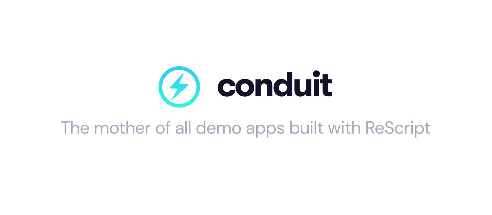

<p align="center">
  
  <br />
  <br />
  <a target="_blank" href="https://github.com/rescripbr/rescript-conduit"> Live Demo </a> ●
  <a target="_blank" href="https://github.com/gothinkster/realworld"> Official Repository </a> ●
  <a target="_blank" href="https://www.figma.com/file/zC8MJMVbnWGvHNYkBWe1kI/Conduit?node-id=1%3A46"> Figma </a> ●
  <a target="_blank" href="https://rescript-lang.org/"> Official ReScript Docs </a> ●
  <a target="_blank" href="https://github.com/rescripbr"> ReScript Brazil Community </a>
</p>

<br />

## About 💡

This project is an implementation of the **"Real World App"** built with ReScript and React. You can read more about that [here](https://github.com/gothinkster/realworld).

## Requirements ✔️

- Yarn v1.X
- NodeJS

## Up & Running 🚀

1. Install all dependencies:

```sh
$ yarn
```

2. Run the ReScript compiler to build the project:

```sh
$ yarn rescript:build
```

3. Now, run the ReScript compiler with watch mode enabled:

```$
$ yarn rescript:watch
```

4. Run the Vite development server:
```$
$ yarn vite
```

And finally, open the application that is running on `http://localhost:3000` 😃

## Running with Docker 📦

```sh
$ docker-compose up -d
```

## Scripts ▶️

| Script            | Descrição                                                                      |
| ----------------- | ------------------------------------------------------------------------------ |
| `rescript:watch`  | Run the compiler with the watch mode enabled                                   |
| `rescript:build`  | Run the compiler with the build mode enabled                                   |
| `rescript:clean`  | Run the compiler with the clean mode enabled                                   |
| `vite:dev`        | Run the ViteJS development server                                              |
| `vite:build`      | Run the ViteJS with the build mode enabled                                     |


## License
MIT
